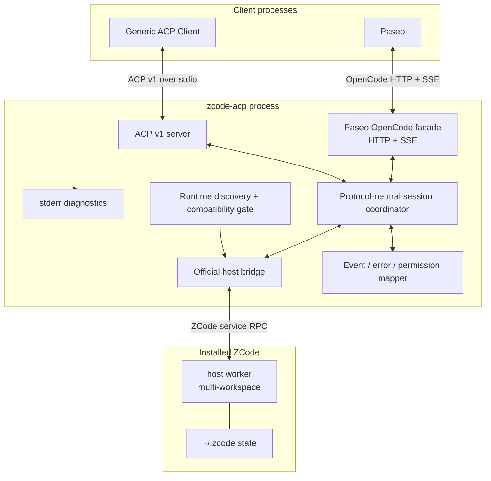
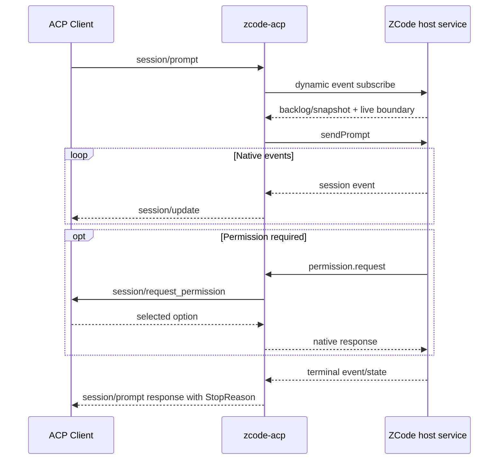

# アーキテクチャ

## 1. 設計原則

`zcode-acp` はprotocol proxyではなく、異なる状態機械を接続するadapterです。外側のACP JSON-RPCまたはPaseo向けOpenCode HTTP/SSE envelopeを内側へ付け替えるだけでは、prompt完了、permission、cancel、session replayの意味が一致しません。

設計では次を優先します。

- ACP clientからZCode private RPCを隠蔽する
- ZCode official host serviceを公式配布物と同じruntimeで起動する
- capabilityを実装事実から生成する
- 未知の状態やversionを推測で変換しない
- process、workspace、session、promptのライフサイクルを分離する
- 再送による二重ツール実行を防ぐ

## 2. コンポーネント



### 2.1 ACP server

責務:

- stdinからJSON-RPC 2.0 frameを読む
- connection initializationとprotocol version negotiation
- ACP request/notificationのschema validation
- client callback requestの相関
- stdoutへACP frameだけを直列化

### 2.1.1 Paseo OpenCode facade

責務:

- Paseoが固定するOpenCode SDK 1.14.46のHTTP routeとglobal SSE eventを提供
- model / thought level / modeをprovider / variant / primary agentへ変換
- native structured inputとpermission optionを`question.asked`へlosslessに変換
- `127.0.0.1`だけにbindし、stdout readiness lineとstderr diagnosticsを分離
- ZCodeに意味保存して写像できないrewind/archiveを明示的に拒否

### 2.2 Runtime discovery and compatibility gate

責務:

- install rootを一意に解決
- runtime executable、CLI entry、metadataの組を検証
- app version/build、platform、`zcode.cjs version`のCLI version、metadata hashをsupport matrixと照合
- CLI SHA-256は公式artifactとの差分として診断するが、host互換性の選択条件にはしない
- artifact固有descriptorからhost index/RPC moduleを解決し、install root内であること、SHA-256、必要な`g/i/j` exportを検証
- 起動前の軽量doctor smoke

不一致時はprocessを起動しません。システムNodeや別install rootのCLIへfallbackしません。

### 2.3 Official host bridge

責務:

- 公式host workerとRPC channelを一connectionにつき一つ起動
- Electron utility-processのMessagePort shapeをNode workerへ適合
- service method allowlistとstrict result schema
- artifact固有のservice channelと意味ベース操作をversion別contract adapterでnative RPCへ変換
- child stdout/stderrをACP stdoutから隔離
- graceful shutdownとforce cleanup

workspace keyは最低でもcanonical absolute cwdから導出します。symlink解決、大文字小文字、存在しないpathの扱いはplatformごとのテストで固定します。

中立コアがbridgeへ渡す操作は`cancelGeneration`、`respondStructuredInput`、`respondPermission`です。3.3.6 adapterは`zcode-agent`上の`stopSession` / `respondUserInput` / response objectへ、3.8.1、3.9.1、および3.9.2 adapterは`zcode-task`上の`stopGeneration` / `respondElicitation` / option IDへ変換します。3.8.1、3.9.1、および3.9.2のnative `taskId`は公開session IDと同じopaque IDですが、parameter名の変換はadapter内だけで行います。

### 2.4 ZCode protocol client

責務:

- private RPC request IDの採番
- 30秒を基準にしたrequest timeout。ただし長時間operationはmethod別timeoutを定義
- response/error/reverse request/notificationの分類
- schema validation
- parse failure時のtransport close

ACP request IDとZCode request IDを同一視せず、相関mapで結びます。

### 2.5 Protocol-neutral session coordinator

責務:

- 外側protocolのsession IDとして公開するnative ZCode session IDとworkspace keyのbinding
- promptごとの状態機械
- subscribe開始とevent sequenceの管理
- cancel、permission、user inputのpending state
- ACP responseを返せる終端条件の判定

### 2.6 Mapper

責務:

- native eventからACP `session/update` への意味変換
- native終端理由からACP StopReasonへの変換
- permission optionsのlossless bridge
- native errorからACP JSON-RPC errorへの変換
- `_meta.zcode` に入れてよい非secret metadataの選別

## 3. 二重プロトコル境界

| 属性 | 外側: ACP v1 | 内側: ZCode Protocol |
| --- | --- | --- |
| transport | stdio | stdio |
| framing | UTF-8、1 JSON value/line | UTF-8、1 JSON object/line |
| envelope | JSON-RPC 2.0 | 独自RPC、`jsonrpc`なし |
| request ID | JSON-RPC ID | 数値、native clientが採番 |
| server callback | ACP client methods | `interaction/*` reverse request |
| schema | 公開・versioned | private・app version依存 |
| completion | v1 prompt responseのStopReason | native session events/state |

同じNDJSONであることは互換性を意味しません。transport reader/writer、schema、pending request mapを両側で完全に分離します。

## 4. Process lifecycle

### 4.1 起動

1. ACP clientが `zcode-acp` をspawnする
2. `initialize` を受信する
3. ACP versionを選択し、実装済みcapabilityだけを返す
4. `session/new` のabsolute cwdを検証する
5. runtime discoveryとcompatibility gateを実行する
6. host bridgeがなければ公式host workerを起動する
7. native workspace/sessionを作成する
8. subscription確立後にACP sessionを返す

childをinitialize時に無条件起動しないことで、version mismatchのconnectionではZCodeを起動せずに済みます。ただしdoctorで事前検証できるようにします。

### 4.2 prompt



dynamic subscriptionを`sendPrompt`より先に確立し、send直後のeventを取りこぼさないことが必須です。snapshotとlive eventは公式hostのdelivery boundaryを保持します。

### 4.3 cancel

ACP `session/cancel` はnotificationです。受信後は意味操作`cancelGeneration`を一度だけ送り、選択済みhost contractが対応するnative stop methodへ変換します。pending permission/user input callbackもcancelします。native eventが既にpipe上にある可能性があるため、終端eventまでは順序を保って処理し、その後prompt responseを `cancelled` で完了します。

### 4.4 shutdown

1. 新規ACP request受付を停止
2. pending ACP requestを規定error/cancelで完了
3. native stdinを閉じる
4. child exitを待つ
5. timeout時にprocess group/treeを終了
6. stdout writerをflushして終了

active promptを新childへ自動再送しません。ツールが既に実行済みか判定できず、二重変更を起こすためです。

## 5. State model

### 5.1 Connection state

```text
created -> initialized -> shutting_down -> closed
```

`initialize` 前のsession method、二重initialize、closed後のrequestはprotocol errorです。

### 5.2 Workspace state

```text
absent -> starting -> ready -> stopping -> absent
                     \-> failed
```

`failed` childはactive sessionへ透過再接続しません。次の明示操作で新childを作る場合も、native resumeが成功してからsessionをreadyへ戻します。

### 5.3 Prompt state

```text
idle -> subscribing -> sending -> running -> completing -> idle
                                  |    |
                                  |    +-> cancelling -> completing
                                  +-> awaiting_permission
                                  +-> awaiting_user_input
```

同一sessionにつきactive promptは一つです。second promptをqueueするかrejectするかは、MVPではrejectを選びます。暗黙queueはclientのcancel/ordering期待を曖昧にするためです。

## 6. Session identity

native `createSession` が返すopaqueなZCode session IDをACP session IDとしてそのまま返します。load/resumeでも同じIDをZCode hostへ渡すため、process再起動を越えるadapter mappingは不要です。loadは履歴をreplayし、resumeは履歴をreplayしません。

adapterは常に `sessionId -> workspaceKey` bindingを保持し、別cwdからのresumeやpromptを拒否します。

## 7. Concurrency and ordering

- ACP stdout writerは一つのqueueでserializeする
- native stdout frameは受信順に処理する
- session内eventはsequence/event IDで順序検証する
- 異なるworkspaceの処理は並行可能
- 同一sessionのpromptは直列
- reverse request responseはrequest ID単位でexactly once
- timeout後に届いたresponseはlate responseとして破棄し、別requestへ再利用しない

## 8. Error boundaries

### 8.1 Adapterが復旧できるもの

- unsupported ACP version: initialize応答後に明示終了
- invalid cwd: session/new error
- unauthenticated ZCode: action付きerror
- client permission cancel: promptのcancelled終端

### 8.2 Active sessionを失敗させるもの

- native stdout parse/schema error
- child unexpected exit
- 未知のevent type/schema
- reverse requestの未知method
- provider runtime headersを正しく適用できない

これらを「空応答」や `end_turn` に丸めません。

## 9. Dependency direction

推奨module依存は次です。

```text
cli
 ├─ acp-server ────────┐
 └─ paseo-http-server ─┴─ session-coordinator
                          └─ zcode-runtime
                              ├─ zcode-protocol
                              └─ runtime-discovery
```

`zcode-protocol` はACP型へ依存させず、`acp-server` はZCode bundle pathを直接扱いません。private protocol更新とACP更新を別々にテストできる境界にします。

## 10. 参照実装の使い方

`agentclientprotocol/codex-acp` は、外部app-serverをACPへ変換するTypeScript実装として構造上の参考になります。特に次の分離は参考にできます。

- app-server client
- ACP session connection
- event/tool/approval mapper
- JSON-RPC connection
- fake/e2e tests

ただしCodex app-serverとZCode private RPCのmethod・event・approval semanticsは異なります。クラス名や変換ロジックを機械的に移植しません。
