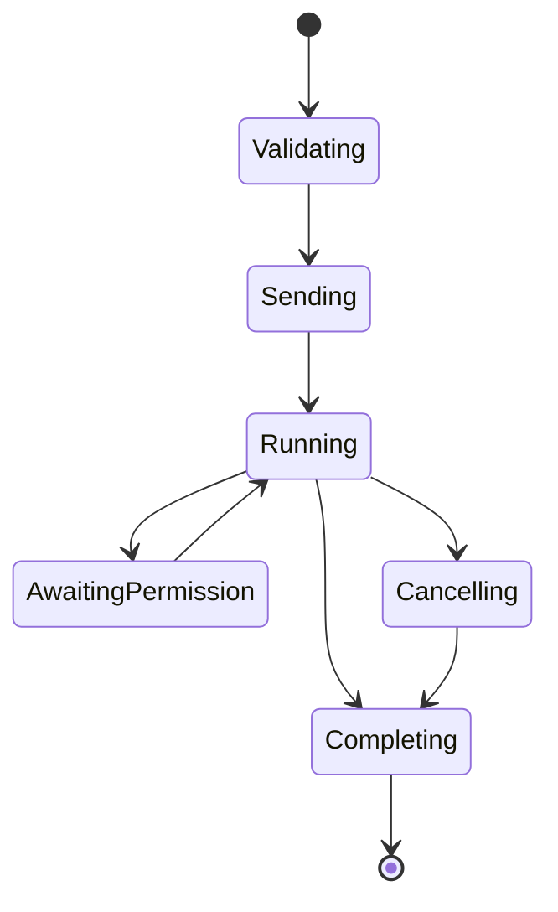

# ACP v1 adapter specification

公開protocolをv1へ固定する理由は[ADR 0006](adr/0006-acp-v1qi-yue-wogu-ding-si-jiang-lai-nopurotokoruban-wofen-li-suru.md)、状態管理を伴う変換構造は[ADR 0004](adr/0004-zhuang-tai-wochi-tupurotokorubian-huan-tositeacptozcodewojie-sok-suru.md)、権限と入力の境界は[ADR 0007](adr/0007-neiteibunoquan-xian-ru-li-zi-ge-qing-bao-nojing-jie-wobao-chi-suru.md)を参照してください。

## 1. Protocol target

現在のwire contractはACP `protocolVersion: 1`、`@agentclientprotocol/sdk` 1.2.1、公式 `schema-v1.19.0` です。

ACP v2は現在の公開contractに含めず、v1/v2のshapeを同じhandlerへ混在させません。

次をexact versionでlockします。

- `@agentclientprotocol/sdk`
- 対応するv1 JSON Schema
- generated typesまたはvalidation fixtures

caret rangeだけでwire contractを更新しないでください。

## 2. ACP stdio transport

- stdin/stdout
- UTF-8
- 1行につき1 JSON-RPC 2.0 message
- request、response、notificationをサポート
- stdoutにはJSON-RPC frame以外を出さない
- stderrにdiagnosticsを出す

外側のframeには必ずACP/JSON-RPCの要件を適用します。ZCode private envelopeをそのまま出力しません。

## 3. Initialization

Client requestのv1 shape:

```json
{
  "jsonrpc": "2.0",
  "id": 0,
  "method": "initialize",
  "params": {
    "protocolVersion": 1,
    "clientCapabilities": {},
    "clientInfo": {
      "name": "example-client",
      "title": "Example Client",
      "version": "1.0.0"
    }
  }
}
```

responseの概念shape（terminal auth capabilityなし）:

```json
{
  "jsonrpc": "2.0",
  "id": 0,
  "result": {
    "protocolVersion": 1,
    "agentCapabilities": {
      "loadSession": true,
      "promptCapabilities": {
        "image": true,
        "audio": true,
        "embeddedContext": true
      },
      "mcpCapabilities": {
        "http": true,
        "sse": true
      },
      "sessionCapabilities": {
        "list": {},
        "resume": {},
        "close": {}
      },
      "auth": {
        "logout": {}
      }
    },
    "agentInfo": {
      "name": "zcode-acp",
      "title": "ZCode via ACP",
      "version": "<zcode-acp version>"
    },
    "authMethods": []
  }
}
```

実際のresponseはpinned SDK/schemaで生成します。`loadSession`、list/resume/close、image/audio/embedded context、MCP、config/modesをadvertiseします。current host protocolにnative surfaceがないadditional directoriesはadvertiseしません。

clientがterminal auth capabilityを出した場合だけ、adapter自身の`login` subcommandを起動するZCode OAuth methodを返します。logoutは公式ZCode CLIへ委譲します。

## 4. Method surface

### Agent methods

- `initialize`
- `authenticate` / `logout`
- `session/new`
- `session/load` / `session/resume` / `session/list` / `session/close`
- `session/set_mode` / `session/set_config_option`
- `session/prompt`
- `session/cancel` notification

### Client methods used by Agent

- `session/update` notification
- `session/request_permission` request
- `elicitation/create` request（client capabilityがある場合）

ACP v1のstable schemaに他のmethodが存在しても、実装・検証していないmethodはadvertiseせず、呼ばれた場合はmethod not foundまたはcapability violationとして処理します。

## 5. `session/new`

### Input validation

- `cwd` はabsolute path
- pathが存在しdirectoryである
- `additionalDirectories` はcurrent host protocol未対応のため受け付けない
- stdio / HTTP / SSE MCP server listをnative create/resumeへ転送する

### Native sequence

1. workspace keyをcanonicalize
2. compatible ZCode childを取得または起動
3. `workspace/readState` で必要なruntime stateを確認
4. `session/create`
5. `session/subscribe` を確立
6. native session IDとworkspace keyをbinding
7. ACP session IDを返す

subscription開始前にsessionをclientへreadyとして返してはいけません。

### Output

native ZCode session IDをACP session IDとして返し、load/resumeでも同じopaque IDを使用します。[Architecture](03-architecture.md#6-session-identity) のidentity条件は実機で検証済みです。

ZCodeが返すmode/model一覧をACP responseへ入れる場合は、pinned v1 schemaに存在する正式fieldだけを使います。未検証の情報を `_meta` で必須UXにしません。

mode IDはZCode 3.11.2の利用者向けカタログと同じ値を変換せずに使用します。

| ID | Name | Description |
| --- | --- | --- |
| `build` | Ask before changes | Ask before each file changes. |
| `edit` | Edit automatically | Edit selected files or relevant workspace files automatically. |
| `plan` | Plan mode | Inspect the code and present a plan before editing. |
| `yolo` | Full access | Edit and run commands with fewer confirmations. |

`session/set_mode`はこの4 IDだけをnative `setMode`へそのまま渡します。native snapshotの現在modeがこのカタログに含まれない場合はprotocol不整合として拒否し、別のmodeへ変換しません。private schemaに残る旧modeをACPの選択肢として公開しません。

## 6. `session/prompt`

### 6.1 Accepted input

`ContentBlock::Text`、resource link、image、audio、embedded resourceを受理します。binary contentはbase64 byte lengthを検証してnative attachmentへ変換し、remote resource linkは名前とURIを明示したtext contextとして渡します。

複数text blockは順序を保って一つのnative user messageへ変換します。区切りの仕様はgolden testで固定し、単純連結による語の結合を避けます。

### 6.2 Turn lifecycle

ACP v1では `session/prompt` responseがturn完了を表し、`stopReason` を返します。v2のように受付直後にempty responseを返してはいけません。



active turn中はnative eventをACP `session/update` へ変換します。terminal native stateを受信し、全pending reverse requestが解決してからprompt responseを返します。

### 6.3 StopReason mapping

| Native semantics | ACP v1 StopReason |
| --- | --- |
| normal completion | `end_turn` |
| model token limit | `max_tokens` |
| model request/turn limit | `max_turn_requests` |
| explicit model refusal | `refusal` |
| client/native cancellation | `cancelled` |

未知のnative terminal reasonを `end_turn` に丸めません。対応できない場合はpromptをJSON-RPC errorで終了し、redacted native reasonをerror dataへ含めます。

## 7. `session/update` mapping

現在のACP v1 stable update variantsに対するmappingです。

| ZCode event semantics | ACP v1 update | Current |
| --- | --- | --- |
| user message persisted | `user_message_chunk` | 任意。重複表示をclient matrixで確認 |
| assistant text delta | `agent_message_chunk` | 必須 |
| explicitly classified thought delta | `agent_thought_chunk` | 対応可能な場合のみ |
| tool created | `tool_call` | 必須 |
| tool status/content changed | `tool_call_update` | 必須 |
| plan changed | `plan` | event shape確認後 |
| slash commands changed | `available_commands_update` | implemented |
| mode changed | `current_mode_update` | implemented |
| config changed | `config_option_update` | implemented |
| session metadata changed | `session_info_update` | implemented |
| context/cost usage | `usage_update` | implemented |

変換原則:

- textをtool outputとして、またはtool outputをagent messageとして誤分類しない
- tool call IDをnative event間で安定保持する
- ZCodeの絶対pathやcommandを、ACP tool call contentの正式型へ変換する
- thoughtとして明示されていない内部ログを `agent_thought_chunk` にしない
- unknown eventはdiagnosticへ記録してactive turnをfailさせる。silent dropはしない

一部のinformational eventを安全に無視できることがgolden traceで確認できた場合は、event typeごとに明示allowlistへ追加します。

## 8. Permission bridge

ZCode `interaction/requestPermission` とACP `session/request_permission` を対応させます。

### 必須不変条件

- native request IDをpending mapへ保存
- ACP側の各 `optionId` とnative optionを一対一で対応
- labelだけでなくkind/semanticsを保持
- selected outcomeを一度だけnative responseへ変換
- cancelled outcomeをcancelとして返す
- session cancel時はpending permissionもcancel
- client切断時はallowを返さない
- timeout時は安全側へ失敗し、ツールを実行させない

exact payloadはpinned ACP schemaとZCode golden traceから型を生成します。ZCodeにない「allow always」や、ACPにない独自の永続許可を推測で合成しません。

## 9. User-input bridge

ZCode `interaction/requestUserInput` の選択肢質問をACP v1.19のform `elicitation/create`へ変換します。single-selectはstring `oneOf`、multi-selectはarray `anyOf`とし、accept/decline/cancelをnative responseへ一対一で返します。

clientがform elicitation capabilityを出さない場合はnative requestをdeclineしてturnを失敗させます。permission requestへの流用や、agent messageを表示してnative requestを放置する方式は禁止します。

## 10. Provider runtime headers bridge

通常のprovider runtime headersは、公式host service内のmodel-provider serviceがZCodeのcredentialとregistryから構築・適用します。adapterはheader値を受け取りません。

hostからinteractive `providerRuntimeHeaders.request` が届いた場合、headless環境では回復操作を実行できないため、`headersApplied: false` を返してturnを `INTERACTION_UNSUPPORTED` で停止します。成功応答を偽装せず、header値をACP message、logs、test fixtureへ保存しません。

## 11. Cancellation

Clientは次のnotificationを送ります。

```json
{
  "jsonrpc": "2.0",
  "method": "session/cancel",
  "params": {
    "sessionId": "sess_..."
  }
}
```

adapter behavior:

1. active turnをcancellingへ遷移
2. 意味操作`cancelGeneration`をidempotently送り、現在のhost descriptorで`stopGeneration({taskId})`へ変換
3. pending permission/user-inputをcancel
4. 既に受信済みのupdateを順序通りflush
5. native terminal stateを待つ
6. original `session/prompt` responseを `stopReason: cancelled` で返す

ACPのgranular `$/cancel_request` はv1.17.0以降のstable contractとして実装し、SDKのrequest signalを同じ`cancelGeneration`操作へ接続します。wire regression testでrequest ID単位のabortを固定します。

## 12. Session persistence

`loadSession` をadvertiseし、次を実装します。

### `session/load`

- `loadSession` capabilityをadvertise
- ZCode `session/resume` でnative contextを復元
- `session/messages` / `session/events` からhistoryを取得
- ACP `session/update` として順序通りreplay
- replay完了後にoriginal `session/load` responseを返す

### `session/resume`

v1の `sessionCapabilities.resume` をadvertiseする場合、historyをreplayせずに復元します。loadとresumeを同じ動作にしません。

## 13. Config, model, and mode

ZCodeの `session/setModel`、`session/setThoughtLevel`、`session/setMode` をACP v1 session config optionsとmodeへ写像します。

要件:

- nativeで現在利用可能な値だけを選択肢にする
- clientの `session/set_config_option` をnative setterへ変換
- native変更を `config_option_update` で返す
- mode/model/thought levelのIDを混同しない
- `yolo` など高権限modeを明示表示する

現在はACP v1の `session/set_mode` と `session/set_config_option` の両方を正式methodとして処理します。いずれも同じnative session settingsを更新し、native snapshotから生成したmodeとconfig optionsをclientへ返します。

## 14. Error mapping

| Condition | ACP behavior |
| --- | --- |
| malformed JSON-RPC | standard parse/invalid request error |
| unknown method | method not found |
| invalid cwd/content | invalid params |
| unsupported ZCode version | server-defined error with detected versions |
| not logged in | server-defined auth-required error with headless login guidance |
| native protocol/schema mismatch | server-defined compatibility error |
| child exited | active request error、sessionをunhealthy化 |
| permission/user input cancelled | semantic cancellation |
| provider headers not applied | provider configuration error |

JSON-RPC/ACP標準error codeはpinned SDKの定数を使います。独自codeを重複定義しません。

## 15. `_meta.zcode`

標準ACP fieldに入らないdiagnostic metadataは、必要な場合だけ `_meta.zcode` namespaceへ格納します。

格納可能な例:

- redacted native event type
- ZCode app/CLI version
- workspace keyのnon-secret correlation ID
- native trace ID

格納禁止:

- access token、cookie、runtime provider headers
- prompt/tool inputの全文
- credential/config pathの中身
- user home pathを含む不要な絶対path

client機能が `_meta.zcode` に依存しないことを原則とします。

## 16. 対象外のprotocol version

ACP v2は現在の仕様対象外です。対応する場合はADR 0006に従い、version別wire adapter、型、fixture、testを追加し、version negotiation後は一connectionにつき一つのprotocolだけを扱います。
