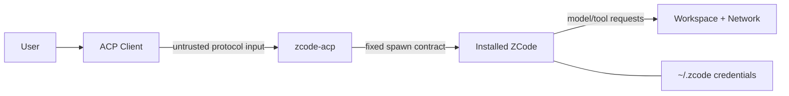

# Security and licensing

## 1. Security goals

`zcode-acp` は、外部client、private RPC、モデル・ツール、local credentialの境界に位置します。主なsecurity goalsは次です。

- ACP clientが明示していない権限を付与しない
- ZCode credentialやprovider headerをadapter経由で漏らさない
- workspace境界を別session/別user間で混在させない
- protocol stdoutを汚染しない
- untrusted pathやargumentをshell commandへ変換しない
- unsupported versionを「たぶん互換」として実行しない

## 2. Trust boundaries

- ACP client inputはschema validation対象
- ZCode eventも、同一machineのchildだからといって無条件に信用しない
- workspace内容はuntrusted data
- model outputはtool実行権限を自動的に得ない
- credential directoryはZCode所有のstateとして扱う

## 3. Permission invariants

次はMUST要件です。

- `interaction/requestPermission` を自動承認しない
- client切断、timeout、unknown optionではallowを返さない
- option IDと意味をlabel文字列から再推測しない
- allow onceとallow alwaysを混同しない
- modeを暗黙に `yolo` へ変更しない
- session cancel後に遅れて届いたallow responseを適用しない
- permission request/responseをsessionとturnへbindingする

permission bridgeが未対応なら、ツール実行を伴うpromptをsupportedと表記しません。

## 4. Credential and header handling

### 4.1 Ownership

credentialの作成・refresh・保存はZCode公式runtimeの責務です。`zcode-acp` はcredential file formatを独自実装しません。

### 4.2 Prohibited data flows

次をstdout、stderr、ACP `_meta`、crash report、test fixtureへ出してはいけません。

- access/refresh token
- OAuth cookie、authorization code
- provider runtime headers
- API key
- full user config
- prompt/tool inputの全文。ただし明示debug modeで別途同意した場合を除く

### 4.3 Redaction

error/dataを転送する前に、key名と値patternの両方でredactします。redaction失敗時はraw errorを転送せず、correlation ID付きのgeneric errorに置き換えます。

`headersApplied: false` の `errorMessage` もheader値を含む可能性があるため、直接clientへ流さずsanitization対象にします。

## 5. Process spawning

- shellを介さず、executableとargsの配列でspawnする
- executable、CLI entry、metadataは同じverified install rootから解決する
- official host module pathは検証済みinstall rootからだけ解決し、user stringを実行scriptへ挿入しない
- cwdはabsolute directoryとして事前検証する
- install rootがgroup/world writableならdoctorで警告または拒否する
- childへ `ELECTRON_RUN_AS_NODE=1` を明示する
- child stdout/stderrを役割別に分離する
- Unixではprocess group、Windows対応時はjob objectなど、platform固有のtree cleanupを検討する

ZCode GUIホストにある開発用command override環境変数を、そのままproduction surfaceとして公開しません。任意command executionになり得るためです。

## 6. Environment variables

childはmodel providerやproxy設定のため一定のenvironmentを必要とする可能性があります。一方、parent environmentの無条件継承はsecret露出面を広げます。

Phase 0で実際に必要なenvironmentを観測し、次のどちらかを明示的に決定します。

- ZCode公式runtimeと同じenvironment継承を行い、運用上clean environmentを要求する
- 必要なvariableのallowlistを定義する

根拠なしのallowlistで必要設定を壊したり、根拠なしの全継承を安全と主張したりしません。どちらを採用しても、environment値はログへ出しません。

## 7. Workspace isolation

- ACP `cwd` をsessionのprimary rootとして固定
- session IDとworkspace keyをbinding
- 別cwdからのprompt/resumeを拒否
- MVPでは `additionalDirectories` capabilityを出さない
- canonicalizationでsymlink、case sensitivity、存在しないpathの挙動を固定
- workspaceごとにZCode childを分離
- childやsessionをOS user間で共有しない

ZCodeツール自体がworkspace外へアクセスできるかはmode/permissionにも依存します。adapterのpath bindingだけでsandboxを保証したと表現しません。

## 8. Protocol hardening

### ACP side

- pinned schemaでvalidation
- maximum line/frame sizeを定義
- pending request数に上限
- duplicate request IDを拒否
- initialize前methodを拒否
- stdout writerをsingle queue化

### ZCode side

- 1 frameごとにJSONとmethod-specific schemaをvalidation
- malformed/unknown reverse requestで安全停止
- request timeoutとlate responseを区別
- event backlogの上限とsequence gap detection
- unknown eventをsilent dropしない

### Denial of service

巨大prompt、巨大tool output、無限event、応答しないpermission clientに上限とtimeoutを設定します。ただしlong-running model turnを固定30秒で切るなど、operation semanticsと無関係な一律timeoutにはしません。

## 9. Logging policy

Default logに含めてよいもの:

- timestamp
- severity
- adapter version
- ZCode/CLI version
- redacted correlation ID
- method/event type
- duration、exit code
- error category

Default logに含めないもの:

- prompt/response text
- tool arguments/output
- environment values
- credential/header
- full absolute home path。必要ならworkspace hashまたはbasename

debug protocol traceを将来提供する場合、明示opt-in、保存先、retention、redaction、警告を必須にします。stdoutへtraceを混ぜません。

## 10. Supply-chain and compatibility

- ZCodeは公式install artifactだけを利用
- adapterはversionとhashをsupport matrixへ記録
- ACP SDKをexact versionでlock
- dependency lockfileをcommit
- release artifactにSBOM/checksumを提供
- unknown ZCode hashは通常起動を拒否
- same versionでもartifact hashが変わった場合は再検証

hash checkはlicenseや署名検証の代替ではありません。platformが提供するcode signing/package verificationもrelease手順へ追加します。

## 11. Licensing boundary

### 11.1 ZCode

配布境界として次を守ります。

- `zcode-acp` packageへZCode artifactを含めない
- downloadしてvendorするinstallerを提供しない
- userが公式配布元から別途インストールする
- runtime pathを検出・起動するだけにする
- ZCode trademark/logoをproject assetへ無断同梱しない

### 11.2 Reference implementations and clients

調査時点のlicense snapshot:

| Project | License/注意 | 利用方針 |
| --- | --- | --- |
| `agentclientprotocol/codex-acp` | Apache-2.0 | 構造の参考。code利用時はnotice条件を確認 |
| ACP SDK/protocol repo | repositoryのlicenseをdependency lock時に再確認 | official SDK/schemaを利用 |
| Toad | AGPL-3.0 | 外部clientとして接続。adapterへcodeを取り込まない |
| acpx | MIT | 外部test clientとして利用 |
| Nori | 独自license addendumの確認が必要 | code baseとして採用しない。法務確認なしに派生しない |

clientを別processとして利用することと、そのcodeをadapterへ組み込むことを区別します。

## 12. Privacy and telemetry

ZCode runtimeが送信するtelemetry、prompt、workspace情報の範囲は今回の調査対象外です。`zcode-acp` は既存ZCodeのnetwork behaviorを変えたり隠したりしません。

公開READMEには次を明記します。

- model/providerとの通信はZCode runtimeが行う
- ZCodeのprivacy policy/termsが適用される
- adapterは既定でprompt contentを永続ログしない
- third-party ACP client側のlogging policyは別途確認が必要

## 13. Security release checklist

- [x] permission allow/deny/cancelのE2E
- [x] `yolo` への暗黙変更がない
- [x] secret fixtureを使ったredaction test
- [x] stdout contamination test
- [x] oversized/malformed private frame test
- [x] symlink/cwd binding test
- [x] child process cleanup test
- [x] unsupported hash/version fail-closed test
- [x] Linux multi-user file permission design review
- [x] release artifactへZCode本体を同梱しないことを確認
- [x] dependency license/SBOM生成
