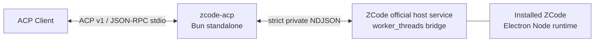

# zcode-acp 設計・実装資料

最終更新: 2026-09-04

このディレクトリには、ZCodeのエージェント機能をACP v1へ公開する`zcode-acp`のArchitecture Decision Records（ADR）、現行仕様、運用手順、検証結果を格納します。設計を選んだ理由はADR、現在のwire shapeや実測値は各仕様書を正とします。

## Architecture Decision Records

ADRの一覧は[Architecture Decision Records](adr/README.md)を参照してください。現在の実装を規定する判断は次の7件です。

1. [ACPアダプターをクライアント非依存とし、UIを外部クライアントに委ねる](adr/0002-acpadaputawokuraiantofei-yi-cun-tosi-uiwowai-bu-kuraiantoniwei-neru.md)
2. [ZCode公式ホストサービスを同梱Electronランタイムで起動する](adr/0003-zcodegong-shi-hosutosabisuwotong-kun-electronrantaimudeqi-dong-suru.md)
3. [状態を持つプロトコル変換としてACPとZCodeを接続する](adr/0004-zhuang-tai-wochi-tupurotokorubian-huan-tositeacptozcodewojie-sok-suru.md)
4. [最新の検証済みZCode 1バージョンだけを厳密にサポートする](adr/0005-zui-xin-nojian-zheng-ji-mizcode-1baziyondakewoyan-mi-nisapotosuru.md)
5. [ACP v1契約を固定し、将来のプロトコル版を分離する](adr/0006-acp-v1qi-yue-wogu-ding-si-jiang-lai-nopurotokoruban-wofen-li-suru.md)
6. [ネイティブの権限・入力・資格情報の境界を保持する](adr/0007-neiteibunoquan-xian-ru-li-zi-ge-qing-bao-nojing-jie-wobao-chi-suru.md)
7. [Linux上で全プラットフォーム向けアダプターのみをビルドする](adr/0008-linuxshang-dequan-puratutohuomuxiang-keadaputanomiwobirudosuru.md)

## 実装済み構成

インストール済みZCodeの公式host serviceを同梱ElectronのNode modeで起動し、desktopと同じmodel provider、credential、runtime headersの経路を利用します。`zcode-acp` は異なる状態機械を接続するadapterであり、private RPCをそのまま公開するproxyではありません。

## 現在の互換性対象

| ZCode | CLI | Host artifact | Host protocol |
| --- | --- | --- | --- |
| 3.11.2 | 0.16.5 | `zcode-host-3.11.2` | `zcode-task-v1` |

同一versionのCLIとhost内容はOS間で同一と扱います。OS差はinstall layoutとmetadata platformの照合だけに限定し、実行済み検証と未実施項目は[Implementation status](10-implementation-status.md)に分離して記録します。

## 現行文書

1. [調査結果](01-investigation.md): 現在のZCode配布物から観測した事実
2. [製品仕様](02-product-spec.md): 公開機能、非目標、要件
3. [アーキテクチャ](03-architecture.md): component、状態遷移、data flow
4. [ZCode private protocol](04-zcode-private-protocol.md): 現在のhost contractとfingerprint
5. [ACP v1 adapter specification](05-acp-v1-adapter-spec.md): ACP wire surfaceと意味変換
6. [Headless Linux運用](06-headless-linux.md): install、認証、診断、障害対応
7. [Security and licensing](07-security-licensing.md): security controlと配布境界
8. [Testing and compatibility](08-testing-compatibility.md): test、release、ZCode更新手順
9. [Implementation status](10-implementation-status.md): 実装済み機能と実機検証結果
10. [References and evidence](references.md): 一次資料、再現command、実測値
