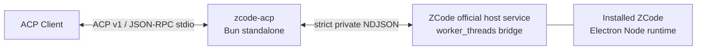

# zcode-acp 設計・実装資料

最終更新: 2026-09-01

このディレクトリは、ZCodeのエージェント機能をGUIなしで利用し、ACP v1 clientへ公開する`zcode-acp`の調査、仕様、実装判断、検証結果をまとめます。

## 実装済み構成

当初調査した`zcode.cjs app-server --stdio`の直接起動は、desktop側のmodel-provider registryを受け取れず、実モデル利用に必要なproviderが0件になります。MVPはインストール済みZCodeの公式host serviceを同梱ElectronのNode modeで起動し、desktopと同じmodel provider、credential、runtime headersの経路を利用します。

## 確定判断

| 項目 | 判断 |
| --- | --- |
| 製品の役割 | ZCode official host serviceとACP v1の意味変換adapter |
| TUI | 別の汎用ACP clientを利用し、このrepositoryでは作らない |
| ACP | released protocol v1、SDK 1.2.1、schema-v1.19.0をlock |
| ZCode起動 | 公式Electron Node runtimeで公式host serviceをworkerとして起動 |
| Node.js | system Nodeへfallbackしない |
| 配布 | ZCodeを再配布せず、adapterだけをstandalone binary化 |
| 互換性 | 最新ZCode 1 versionだけを対象に、metadata semantics、process platform、app/CLI version、host hash/exportをfail closedで検証。buildとmetadata raw hashは診断のみ |
| 権限 | native optionをACP permissionへ一対一変換。自動承認しない |
| ログ | stdoutはACP専用。stderrもsecret/prompt/headerをredact |

## 現在の互換性対象

| ZCode | CLI | Host artifact | Host protocol |
| --- | --- | --- | --- |
| 3.10.2 | 0.16.5 | `zcode-host-3.10.2` | `zcode-task-v1` |

同一versionのCLIとhost内容はOS間で同一と扱い、OS別manifest entryは作りません。OS差はinstall layoutとmetadata platformの照合だけに限定します。実行済み検証と未実施項目は[Implementation status](10-implementation-status.md)に分離して記録します。

structured user inputはACP v1.19のform elicitationへ写像します。clientがform elicitationをadvertiseしない場合だけnative requestをdeclineし、空値で成功扱いしません。

## 文書の読み順

1. [方式選定](00-solution-choice.md)
2. [調査結果](01-investigation.md)
3. [製品仕様](02-product-spec.md)
4. [アーキテクチャ](03-architecture.md)
5. [ZCode private protocol](04-zcode-private-protocol.md)
6. [ACP v1 adapter specification](05-acp-v1-adapter-spec.md)
7. [Headless Linux運用](06-headless-linux.md)
8. [Security and licensing](07-security-licensing.md)
9. [Testing and compatibility](08-testing-compatibility.md)
10. [Implementation plan](09-implementation-plan.md)
11. [References and evidence](references.md)
12. [Implementation status](10-implementation-status.md)

実機結果と未対応範囲を区別し、version文字列だけで互換性を推測しないことが本projectの方針です。新しいZCode releaseへ移行するときは旧artifactを置換し、後方互換分岐を残しません。
